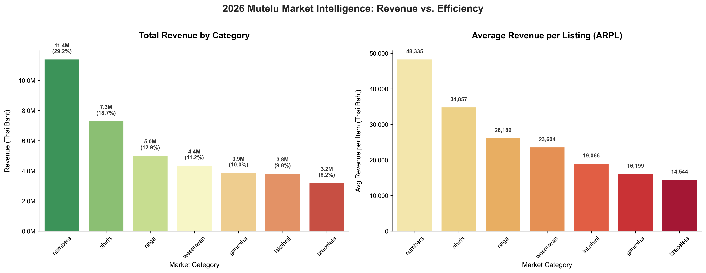
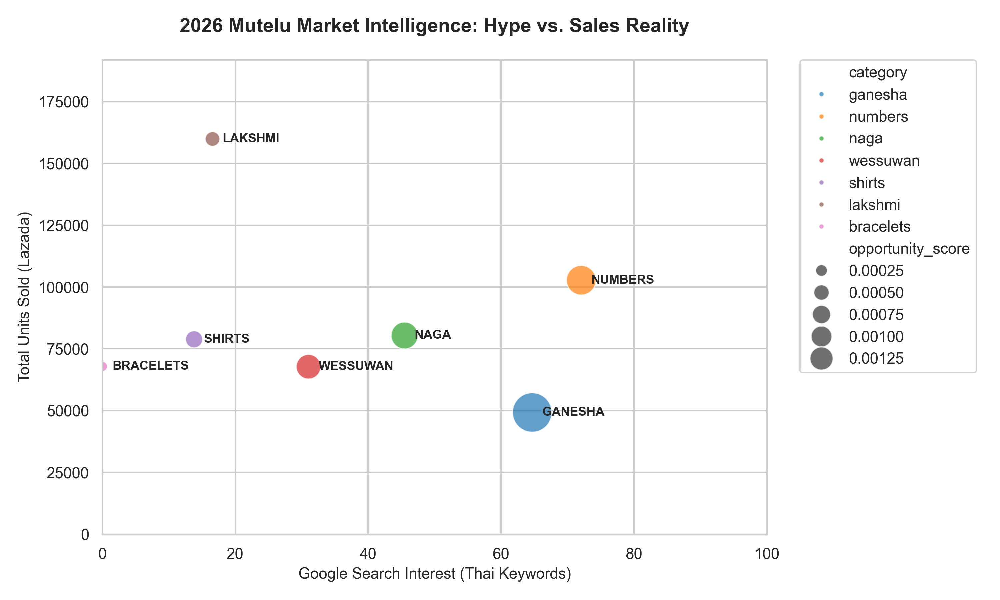

# Mutelu Market Intelligence 2026

## Bridging the Gap Between Search Intent and Sales Reality

This is a data-driven analysis of Thailand's spiritual e-commerce landscape. By combining Google Trends data with scraped data from lazada webpage, I mapped out how consumer search behavior aligns (or doesn't) with actual purchasing patterns across amulets, spiritual items, and lucky numbers.

**The bottom line:** The Mutelu market hit ฿39.1M in 2025, but there's a clear supply-demand gap that most sellers are missing.

---

## Key Findings

### 🎯 The Ganesha Opportunity
Ganesha (พระพิฆเนศ) has the highest search interest (~65-70 on Google Trends) but ranks only 5th in actual revenue. That gap is the opportunity. While Lakshmi (พระแม่ลักษมี) dominates in unit sales, Ganesha shows the strongest Opportunity Score (0.00131)—suggesting demand far exceeds current marketplace supply. For sellers targeting premium segments, this is the category to watch.

### 💰 Lucky Numbers Own the Market
Lucky Numbers (เบอร์มงคล) make up 29.2% of total revenue (฿11.4M) despite lower search volumes. The secret? High average price points (฿479.50). These are the true cash cows—less saturated than deity items and commanding better margins.

### 📉 The Lakshmi Paradox
Lakshmi items sold the most units (~160K) but captured only 9.8% of revenue. This isn't success—it's a race to the bottom. The category is saturated, margins are thin, and unit volume doesn't translate to profit.

---

## Data Pipeline

The analysis flows through a clean sequence: raw data → cleaned datasets → insights → visuals. Each script handles one job, so it's easy to swap out data sources or rebuild parts of the pipeline.

| Stage | Script | What It Does |
|-------|--------|-------------|
| **1. Trends Scraping** | `fetch_trend.py` | Hits Google Trends API for Thai keywords (deities, products, locations). Returns time-series data showing search interest over the past 12 months. |
| **2. Lazada Merge** | `merge_lazada.py` | Combines raw Lazada CSVs (one per category) into a single master file. Labels each row with its category. |
| **3. Data Cleaning** | `cleaner.py` | Removes duplicates, fixes Thai/English encoding, strips outliers and noise (like "cat food" in results). Output is `mutelu_market_clean.csv`. |
| **4. Market Analysis** | `analysis.py` | Calculates ARPL, total volume, pricing tiers. Quick console report with key metrics. |
| **5. Hype vs Reality** | `hype_vs_reality.py` | Maps Thai search trends to English categories. Calculates the "Opportunity Score"—the gap between search interest and actual sales. |
| **6. Executive Report** | `revenue_report.py` | Side-by-side charts: Revenue Market Share + ARPL Efficiency. The actual visualization you'd show a stakeholder. |

---

## Project Structure

```
mutelu-analysis/
├── src/
│   ├── fetch_trend.py          # Pull Google Trends data
│   ├── cleaner.py              # Data wrangling & normalization
│   ├── merge_lazada.py         # Combine raw Lazada CSVs
│   ├── analysis.py             # Calculate metrics and ARPL
│   ├── hype_vs_reality.py      # Supply-demand gap scoring
│   └── revenue_report.py       # Generate dashboards
│
├── data/
│   ├── raw/                    # Unprocessed scraped Lazada data
│   └── processed/              # Cleaned CSV (mutelu_market_clean.csv)
│
├── visuals/                    # Generated charts & dashboards
│
├── requirements.txt
├── .gitignore
└── README.md
```

---

## Getting Started

**1. Clone and set up**
```bash
git clone https://github.com/mg-sarunpat/mutelu-market-analysis.git
cd mutelu-analysis
pip install -r requirements.txt
```

**2. Fetch latest Google Trends data**
```bash
python src/fetch_trend.py
```

**3. Run the analysis pipeline**
```bash
python src/merge_lazada.py     # Merge scraped Lazada sales
python src/cleaner.py          # Clean the data
python src/analysis.py         # Generate statistics
python src/revenue_report.py   # Create visualizations
python src/hype_vs_reality.py  # Identify hype–revenue gaps and market opportunities
```

The results will appear in `data/processed/` and `visuals/`.

---

## 📊 2026 Market Intelligence Dashboard

Here's where the data gets interesting. Below is the complete breakdown of all ฿39.1M across categories—with one crucial metric baked in: **ARPL (Average Revenue per Listing)**. This is what separates the real money-makers from the volume grinders.

### Category Breakdown & Strategic Classification

| Category | Market Share | Avg Rev/Listing | Strategic Role |
|----------|:---:|:---:|---|
| **Numbers** | 29.2% | ฿48,335 | 💎 High-Margin King |
| **Shirts** | 18.7% | ฿34,857 | 📈 Strong Performer |
| **Naga** | 12.9% | ฿26,186 | 🐉 Stable Growth |
| **Wessuwan** | 11.2% | ฿23,604 | 🛡️ Established Niche |
| **Lakshmi** | 9.8% | ฿19,066 | 🌊 High-Volume/Low-Margin |
| **Ganesha** | 10.0% | ฿16,199 | 🚀 Under-Served Opportunity |
| **Bracelets** | 8.2% | ฿14,544 | 📉 Saturated Market |

### What This Really Means

**Lucky Numbers Win on Efficiency.** At ฿48,335 per listing, Numbers dominate. These are digital assets—consumers pay premium prices for the *right* number, not bulk quantities. It's not just a volume play; it's a precision play.

**Ganesha Has the Biggest Gap.** High search interest, but the current ARPL (฿16,199) fall behind Naga and Wessuwan. This isn't a weak category—it's a *mismatched* one. The demand is there. The listings just aren't capturing it yet.

**Lakshmi Is a Speed Trap.** Highest unit sales (~160K), but lowest revenue per listing (฿19,066). You can move volume here, but margins get squeezed fast. Only enter if you have scale or a genuine cost advantage.

---

## Visualizations

The charts below tell the complete story:


*Side-by-side breakdown: Total Revenue Market Share (left) vs. Listing Efficiency / ARPL (right).*


*The Search Intent vs. Sales Volume Gap analysis.*

---

## Methodology & Data Integrity

Here's the thing: I scraped 6–7 top-performing listings per category,so the sample sizes aren't consistent across products. Some categories had more listings with data than others, so raw revenue totals alone would be misleading. To handle this fairly, I use two normalization techniques:

**Average Revenue per Listing (ARPL):** Instead of just adding up all sales, I calculate the mean revenue per product. This tells you which categories actually perform best on a per-listing basis, regardless of how many items I scraped.

**Opportunity Ratio:** The "Hype vs. Reality" score is a straightforward ratio: Search Interest ÷ Sales Volume. Using a ratio means we can spot supply gaps even when the raw sample count is smaller—it's not about absolute numbers, it's about proportional mismatch.

### Important Caveats

**Snapshot Data:** This is a single point-in-time snapshot from February, 2026. The market moves fast, especially for seasonal items. Check back periodically if you're using this for real decisions.

**Top-Heavy Bias:** The scraper specifically targeted top search results and best sellers. So the revenue figures here represent what the *leaders* are doing—the listings winning visibility and conversions. It's not the full market, it's the visible, dominant part of it.

---

## Why This Matters

The spirituality market in Thailand has always been a thing—but today, it operates as a sophisticated e-commerce ecosystem. Sellers often compete on volume (especially in Lakshmi), but the data shows that margin-focused strategies (e.g., Ganesha, Lucky Numbers) are where real money lives. If you're planning on entering this market, chasing Lakshmi volume could potentially be a mistake. The smarter play is to look for a premium niche where demand is obvious but supply is thin.

---

## Dependencies

- **pytrends** — Google Trends API
- **pandas** — Data manipulation
- **seaborn / matplotlib** — Visualization
- **Python 3.8+**

See `requirements.txt` for full details.

---

## Author

**Sarunpat Sanguansak** 3rd Year Liberal Arts Student at Thammasat University

**Last updated:** March 2026
